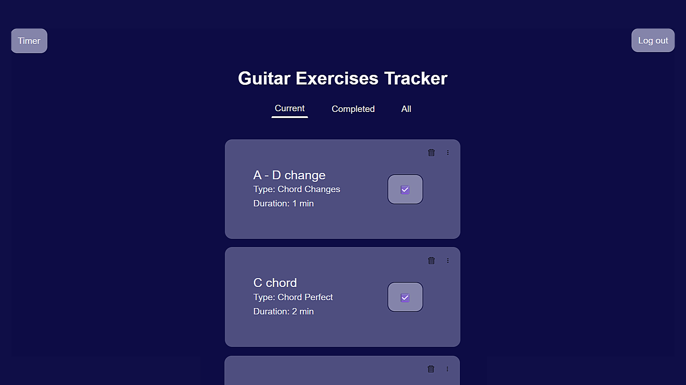
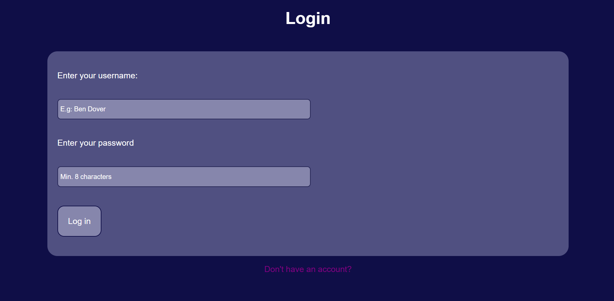
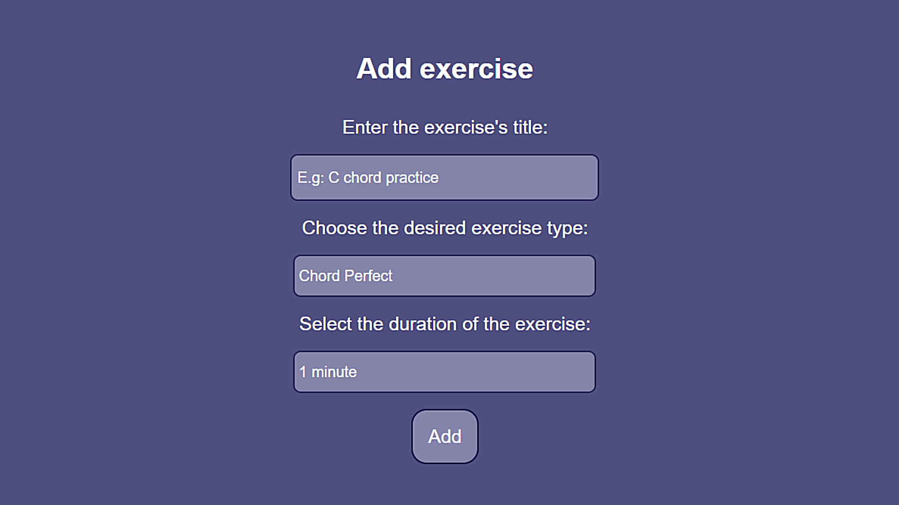

# Guitar-Exercises-Site
A full-stack web application which lets you keep track of your guitar exercises routine.
- for those interested of keeping on track with their guitar learning.
- This project uses both json web token and bcryptjs so as to securely log into your account and access your tasks.



You can try this webpage for yourself [here](https://pampu-rares.github.io/Guitar-Exercises-Site/).

## Getting Started

### Prerequisites

This project requires Node.js (which includes npm) installed on your system.
- If you do not have Node.js installed, you can install it from [here](https://nodejs.org/en/download);

### Installation

1. Paste this line into your terminal:

```shell
git  clone  https://github.com/Pampu-Rares/Guitar-Exercises-Site.git
```

2. Change the default values of the `.env` file if you wish so:

```env
PORT=5050 # you can leave the port number as is
MY_SECRET="I love JS" # change this with any other string
```

3. Open a terminal in the `Guitar-Exercises-Site` folder and write:

```shell
npm run dev
```

4. Open a tab in your browser to localhost:5050 or the port number you have written in the .env file.

## Usage

### Login page

After opening the webpage for the first time, you create (or sign into) your account


### Homepage

You will afterwards be forwarded to the homepage. Here, you can start adding, editing and completing exercises to practice your guitar skills. After finishing with a particular set of exercises, you can delete them and add new ones.


This web application is intended as a way for you to have your practice exercises in one place and complete them in a gamified manner

- ⌚There is also a timer in the top left corner with which to keep track of your time.

## License

Distributed under the MIT License. See `LICENSE` for more information

## Contact
For improvements or suggestions you can contact me here:
Pampu Rares - [rarespampu@gmail.com](mailto:rarespampu@gmail.com)
