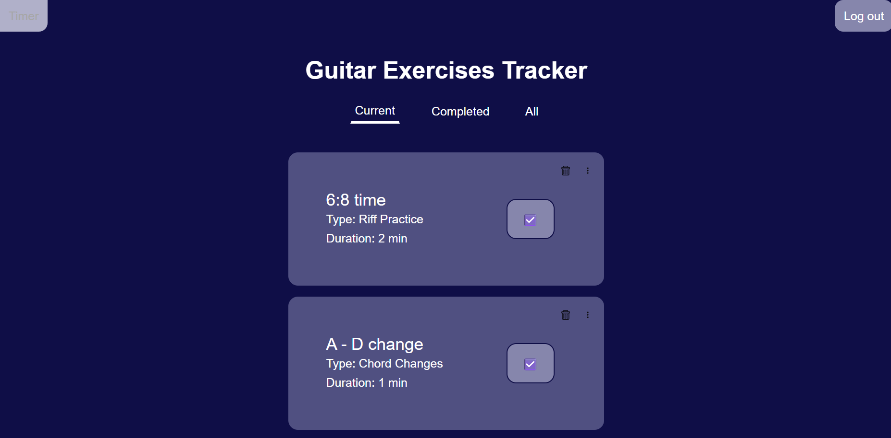

# Guitar-Exercises-Site
A website which lets you keep track of your guitar exercises routine.
- for those interested of keeping on track with their guitar learning.



## Getting Started

### Prerequisites

This project requires Node.js (which includes npm) installed on your system.
- If you do not have Node.js installed, you can install it from [here](https://nodejs.org/en/download);

### Installation

1. Paste this line into your terminal:

```shell
git  clone  https://github.com/Pampu-Rares/Guitar-Exercises-Site.git
```

2. Change the default values of the `.env` file if you so wish:

```env
PORT=5050 # you can leave the port number as is
MY_SECRET="I love JS" # change this with any other string
```

3. Open a terminal in the `Guitar-Exercises-Site` folder and write:

```shell
npm run dev
```

4. Open a tab in your browser to localhost:5050 or the port number you have written in the .env file.

## Usage

### Login page

After opening the webpage for the first time, you will create (or sign into) an account


### Homepage

Next, you can start adding exercises to practice your guitar skills.
There is also a timer in the top left corner with which to keep track of your time.

### Additional Features

This project uses both json web token and bcryptjs so as to securely access log into your account and access your tasks.

## Known Issues

- Timer:
After pausing the timer, it does not resume from where it was paused. Instead, it restarts from the beginning.

## License

Distributed under the MIT License. See `LICENSE` for more information

## Contact
For improvements or suggestions you can contact me here:
Pampu Rares - [rarespampu@gmail.com](mailto:rarespampu@gmail.com)